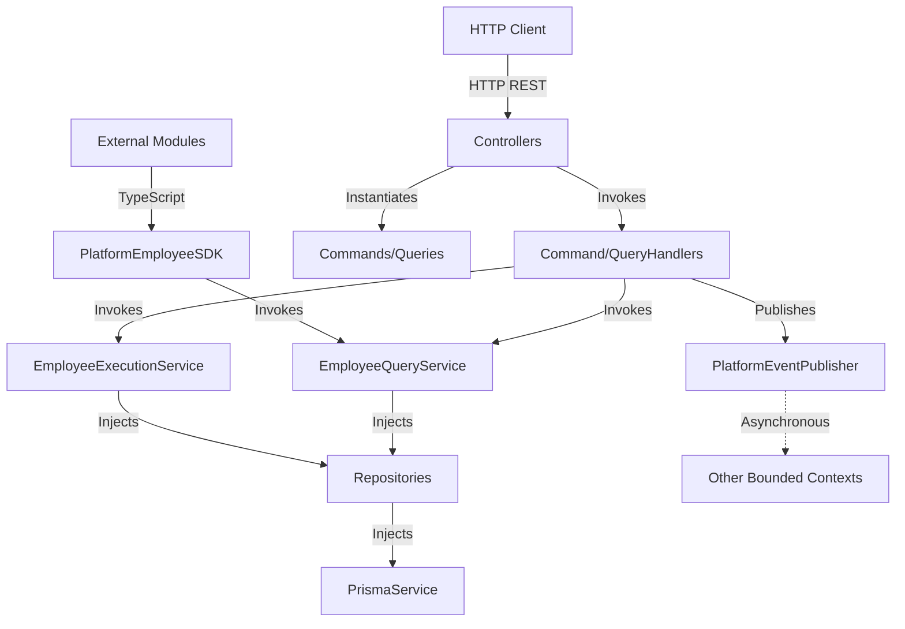
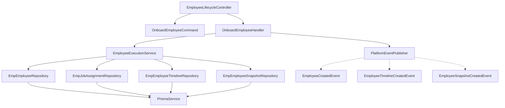
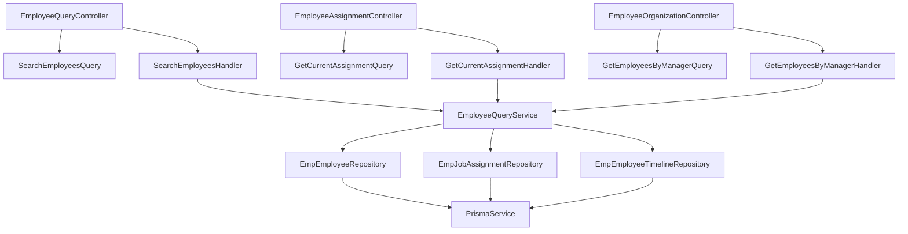
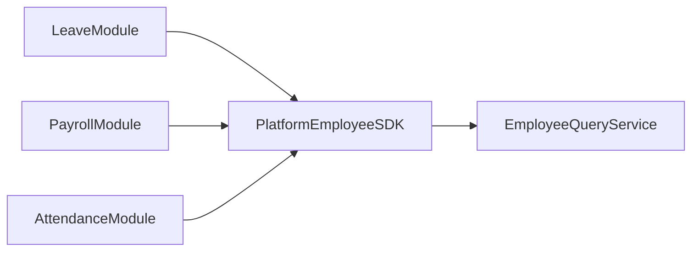

# 05_DEPENDENCY_GRAPH

## Table of Contents
1. [Overview](#overview)
2. [Macro Dependency Flow](#macro-dependency-flow)
3. [Command Flow Graph](#command-flow-graph)
4. [Query Flow Graph](#query-flow-graph)
5. [Cross-Module Interactions](#cross-module-interactions)
6. [References](#references)

## Overview
This document details the exact dependency direction and execution flow within the `Employee` bounded context. The architecture enforces a strict top-to-bottom dependency graph where higher-level constructs (Controllers) depend on lower-level constructs (Handlers, SDKs), which depend on Services, and finally Repositories.

## Macro Dependency Flow
The macro flow dictates the allowed directions of imports and invocations.

## Command Flow Graph
The command flow represents mutations (writes) to the system state.

*(This exact flow applies symmetrically to all other commands: Join, Confirm, Promote, Transfer, Resign, Terminate, Exit, Rehire, BeginProbation).*

## Query Flow Graph
The query flow represents reads from the system state without side effects.

## Cross-Module Interactions
The Employee module does not import dependencies from other domain modules.
It exposes the `PlatformEmployeeSDK`.

## References
- See [04_MODULE_REGISTRATION.md](04_MODULE_REGISTRATION.md) for actual IoC registrations.
- See [12_EXECUTION_SERVICES.md](12_EXECUTION_SERVICES.md) for transactional flow logic.
- See [14_SDK.md](14_SDK.md) for SDK exposure.
