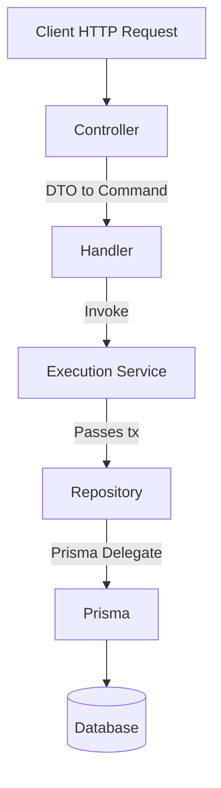
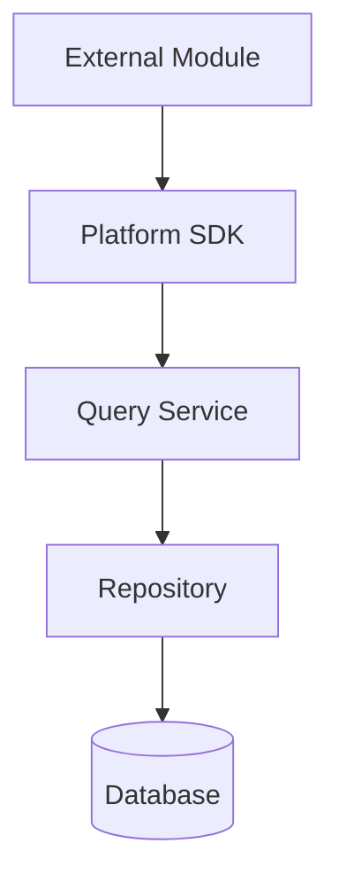
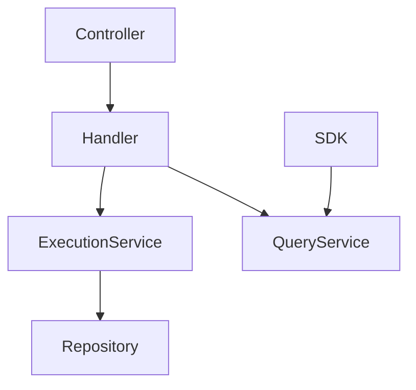
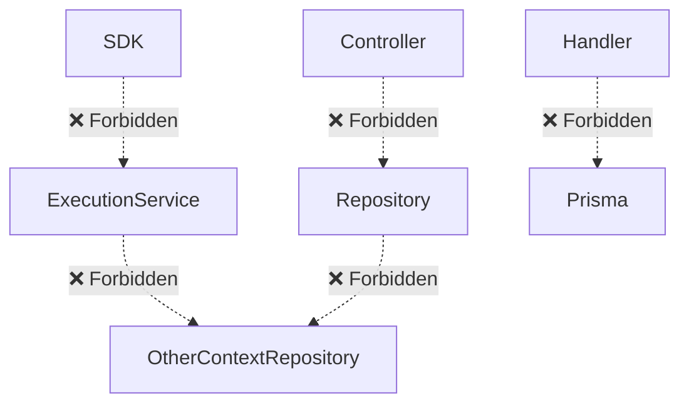
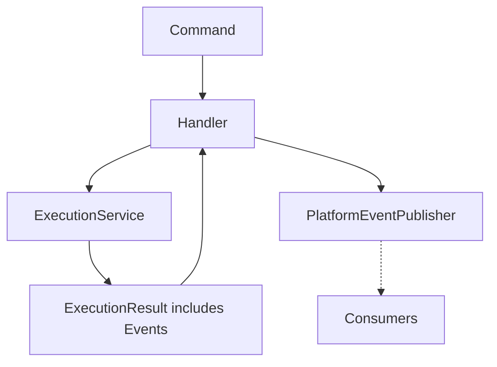
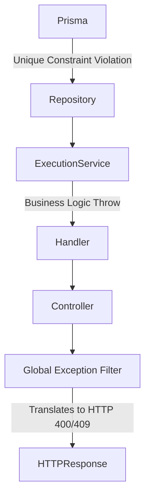
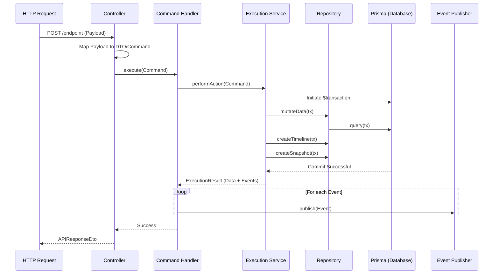

# 00_ENTERPRISE_MODULE_ARCHITECTURE_STANDARD

## Table of Contents
1. [Purpose](#1-purpose)
2. [Enterprise Architecture Principles](#2-enterprise-architecture-principles)
3. [Enterprise Layered Architecture](#3-enterprise-layered-architecture)
4. [Canonical Module Structure](#4-canonical-module-structure)
5. [Canonical Module Boundaries](#5-canonical-module-boundaries)
6. [Canonical Dependency Rules](#6-canonical-dependency-rules)
7. [CQRS Standard](#7-cqrs-standard)
8. [Repository Standard](#8-repository-standard)
9. [Execution Service Standard](#9-execution-service-standard)
10. [Query Service Standard](#10-query-service-standard)
11. [SDK Standard](#11-sdk-standard)
12. [Controller Standard](#12-controller-standard)
13. [API Standard](#13-api-standard)
14. [Event Standard](#14-event-standard)
15. [Dependency Injection Standard](#15-dependency-injection-standard)
16. [Transaction Standard](#16-transaction-standard)
17. [Error Propagation Standard](#17-error-propagation-standard)
18. [Canonical Naming Standards](#18-canonical-naming-standards)
19. [Engineering Standards](#19-engineering-standards)
20. [Forbidden Practices](#20-forbidden-practices)
21. [Canonical Request Sequence](#21-canonical-request-sequence)
22. [Compliance Checklist](#22-compliance-checklist)
23. [Cross Reference Matrix](#23-cross-reference-matrix)
24. [Architecture Validation Checklist](#24-architecture-validation-checklist)

---

## 1. Purpose
- **Authority:** This document is the ultimate, non-negotiable engineering standard governing the ERP platform.
- **Scope:** Governs the internal architecture, dependencies, naming conventions, and structural boundaries of all bounded contexts.
- **Applicability:** Mandatory for every current and future feature module (Leave, Payroll, Attendance, etc.).
- **Compliance:** Deviations from this standard are strictly forbidden. PRs failing these standards will be rejected.
- **Architecture Governance:** Changes to this standard require Principal Architect approval and cross-module refactoring.

---

## 2. Enterprise Architecture Principles

### Repository Encapsulation
- **Definition:** All database interactions are strictly encapsulated behind custom Repository classes.
- **Intent:** Isolate the ORM (Prisma) from business logic to enable reliable multi-tenant scoping.
- **Evidence:** `EmpEmployeeRepository`, `EmpJobAssignmentRepository` exclusively inject `PrismaService`.
- **Mandatory Rule:** Services MUST NEVER inject or call `PrismaService` directly.
- **Rationale:** Ensures global constraints (e.g., `where: { tenantId }`) are never bypassed.
- **Source Documents:** `13_REPOSITORIES.md`, `21_IMPLEMENTATION_PATTERNS.md`

### Strict CQRS Segregation
- **Definition:** Complete structural and logical separation of Commands (mutations) and Queries (reads).
- **Intent:** Prevent read logic from tangling with complex transaction boundaries, allowing independent scaling.
- **Evidence:** Segregated folders (`commands/`, `queries/`) and separated services (`EmployeeExecutionService`, `EmployeeQueryService`).
- **Mandatory Rule:** Mutations and reads MUST NOT share Handlers, Services, or Controller classes.
- **Rationale:** Reduces cognitive load and prevents side-effect leakage.
- **Source Documents:** `05_DEPENDENCY_GRAPH.md`, `12_EXECUTION_SERVICES.md`, `26_ARCHITECTURAL_DECISIONS.md`

### Anti-Corruption SDK Boundary
- **Definition:** Inter-module communication occurs strictly through exported SDKs.
- **Intent:** Prevent tight coupling to internal database schemas across bounded contexts.
- **Evidence:** `PlatformEmployeeSDK` is the sole class exported from `EmployeeModule`.
- **Mandatory Rule:** Modules MUST NOT export Repositories, Services, or internal logic.
- **Rationale:** Allows modules to evolve internally without breaking external consumers.
- **Source Documents:** `04_MODULE_REGISTRATION.md`, `14_SDK.md`

### Centralized Transaction Ownership (Unit of Work)
- **Definition:** The Execution Service initiates a transaction block and orchestrates downstream repositories.
- **Intent:** Ensure atomicity across multiple entity updates, timelines, and snapshots.
- **Evidence:** `EmployeeExecutionService` utilizes `this.prisma.$transaction` and passes the `tx` client.
- **Mandatory Rule:** Handlers and Controllers MUST NOT own transactions.
- **Rationale:** Keeps transaction boundaries tied directly to business domain logic.
- **Source Documents:** `12_EXECUTION_SERVICES.md`, `21_IMPLEMENTATION_PATTERNS.md`

### Dual Audit Integrity
- **Definition:** Every mutation creates both a timeline entry and a snapshot entry.
- **Intent:** Provide a cryptographically-inspired, tamper-proof history of state changes.
- **Evidence:** `createTimelineEntry` and `createSnapshot` inside `EmployeeExecutionService`.
- **Mandatory Rule:** Every module owning a core entity MUST persist Timeline and Snapshot records during mutations.
- **Rationale:** Enables historical point-in-time reconstruction for auditing.
- **Source Documents:** `18_LOGGING_AND_AUDIT.md`, `26_ARCHITECTURAL_DECISIONS.md`

---

## 3. Enterprise Layered Architecture

### HTTP Request Flow


### SDK Flow (Inter-Module)


---

## 4. Canonical Module Structure
Every module MUST replicate this folder hierarchy and contain the following required files:

```text
modules/<context>/
├── api/
│   ├── dtos/          # Required: requests.dto.ts, queries.dto.ts, responses.dto.ts
│   └── mappers/       # Required: <context>.mapper.ts
├── commands/          # Required: POJO command classes
│   └── handlers/      # Required: Specific Handler classes
├── controllers/       # Required: <context>-lifecycle.controller.ts, <context>-query.controller.ts
├── events/            # Required: Domain event classes
├── queries/           # Required: POJO query classes
│   └── handlers/      # Required: Specific Handler classes
├── repositories/      # Required: <Entity>Repository, <Entity>TimelineRepository, <Entity>SnapshotRepository
├── sdk/               # Required: platform-<context>.sdk.ts
│   └── dtos/          # Required: SDK-specific DTOs
└── services/          # Required: <context>-execution.service.ts, <context>-query.service.ts
```

- **Required Registration:** `[Context]Module.ts` MUST export only the SDK.

---

## 5. Canonical Module Boundaries

### Allowed Dependency Graph


### Forbidden Dependency Graph


---

## 6. Canonical Dependency Rules

- **Dependency Direction:** MUST flow downwards. Transport Layer -> Orchestration -> Business Logic -> Data Access.
- **Ownership:** A bounded context completely owns its data. No external context may read/write to its tables directly.
- **Provider Visibility:** All internal Repositories, Services, and Handlers MUST remain private to the module (not exported).
- **Export Rules:** ONLY the `Platform<Context>SDK` may be listed in the `@Module` `exports` array.

---

## 7. CQRS Standard

- **Commands:** POJOs containing `tenantId`. Define imperative state mutations.
- **Queries:** POJOs containing `tenantId`. Define read intent.
- **Handlers:** Connect Intents to Services. Must NOT contain business logic.
- **Execution Services:** Own the `$transaction`.
- **Query Services:** Own read coordination.
- **Execution Flow:** HTTP -> Controller -> Handler -> Service -> Repository.
- **Registration:** Explicit injection (no `@nestjs/cqrs` generic buses).

---

## 8. Repository Standard

- **Repository Ownership:** A repository MUST own exactly one Prisma Aggregate model.
- **Prisma Ownership:** Only repositories are permitted to inject `PrismaService`.
- **Transaction Participation:** MUST accept an optional `tx: any` parameter to join upstream Unit of Work blocks.
- **Tenant Isolation:** MUST enforce `where: { tenantId }` on all operations.
- **Restrictions:** MUST NOT publish events. MUST NOT orchestrate other repositories.

---

## 9. Execution Service Standard

- **Responsibilities:** Enforcement of domain rules, managing transactions, coordinating multiple repositories.
- **Transactions:** MUST initiate `this.prisma.$transaction` and wrap all mutations.
- **Validation:** Throws exceptions if domain rules are violated (e.g., invalid state transitions).
- **Timeline/Snapshot Creation:** MUST invoke timeline and snapshot repository creation during the transaction.
- **ExecutionResult:** MUST return an object containing the mutated data and an array of instantiated Events.
- **Restrictions:** MUST NOT publish events directly. MUST NOT catch validation exceptions meant for the client.

---

## 10. Query Service Standard

- **Responsibilities:** Complex read orchestration, mapping database schemas to internal DTOs.
- **Repository Coordination:** Authorized to inject and query multiple internal repositories.
- **Restrictions:** MUST NOT start transactions. MUST NOT mutate data.

---

## 11. SDK Standard

- **Responsibilities:** Cross-module Anti-Corruption Layer.
- **Public API:** Strictly typed methods returning SDK-specific DTOs (never Prisma objects).
- **Consumers:** Any external bounded context.
- **Exports:** The singular export of the Module.
- **Restrictions:** MUST NOT expose mutation operations.

---

## 12. Controller Standard

- **Responsibilities:** Extracting HTTP payloads, user identity, and tenant context.
- **Routing:** Decorated endpoints defining the REST surface.
- **Validation:** Defers entirely to NestJS validation pipes.
- **Mapping:** Injects a Mapper to transform outputs into `APIResponseDto`.
- **Permissions:** MUST apply `@UseGuards(JwtAuthGuard, PermissionGuard)` and `@RequirePermissions()`.
- **Restrictions:** MUST NOT inject Services or Repositories. MUST NOT implement business logic.

---

## 13. API Standard

- **DTO Organization:** Isolated in `api/dtos/`.
- **Validation:** Mandated use of `class-validator` (e.g., `@IsUUID()`, `@IsString()`).
- **Serialization:** All responses MUST wrap in `APIResponseDto<T>`.
- **Mapper Organization:** Isolated in `api/mappers/`.

---

## 14. Event Standard

- **Naming:** Past tense (e.g., `EmployeeConfirmedEvent`).
- **Lifecycle:** 
  1. Instantiated in Execution Service.
  2. Returned via `ExecutionResult`.
  3. Published by Handler.
- **Publishing:** Uses `PlatformEventPublisher`.
- **Consumption:** Handled asynchronously by other modules.
- **Restrictions:** MUST NOT be published if the transaction fails.

### Event Lifecycle Diagram


---

## 15. Dependency Injection Standard

- **Constructor Injection ONLY:** All dependencies MUST be injected via the constructor.
- **No Property Injection:** `@Inject()` on class properties is forbidden.
- **No Manual Instantiation:** Never use `new Service()` for injectable providers.
- **No Service Locator:** Never inject `ModuleRef` to fetch dependencies dynamically.
- **Provider Registration Rules:** Register explicitly in the module's `providers` array.
- **Provider Lifetime:** Default (Singleton/Transient as defined by framework, avoiding request-scoped unless strictly necessary for multi-tenancy context).

---

## 16. Transaction Standard

| Component | Role | Rules |
| :--- | :--- | :--- |
| **Execution Service** | **Owner** | MUST start the transaction (`$transaction`). MUST pass `tx` downwards. |
| **Repository** | **Participant** | MUST accept `tx` and execute queries against it (`tx || this.prisma`). |
| **Handler** | **Forbidden** | MUST NEVER start a transaction. |
| **Controller** | **Forbidden** | MUST NEVER start a transaction. |
| **SDK** | **Forbidden** | MUST NEVER start a transaction. |

---

## 17. Error Propagation Standard

### Complete Error Flow

- **Ownership:** Execution Services own business logic exceptions. Controllers do NOT catch them. Exception Filters own the HTTP transformation.

---

## 18. Canonical Naming Standards

- **Folders:** `kebab-case`.
- **Files:** `kebab-case.suffix.ts`.
- **Classes/Interfaces:** `PascalCase`.
- **Repositories:** `[Entity]Repository`.
- **Services:** `[Context]ExecutionService`, `[Context]QueryService`.
- **SDK:** `Platform[Context]SDK`.
- **Handlers:** `[Action][Context]Handler`.
- **Commands/Queries:** `[Action][Context]Command`, `[Action]Query`.
- **Events:** `[Entity][ActionPastTense]Event`.
- **DTOs:** `[Action][Entity]RequestDto`.

---

## 19. Engineering Standards

- Every Repository **MUST** own exactly one aggregate.
- Every Handler **MUST** perform one responsibility (execute one Intent).
- Every Controller **MUST** remain entirely free of business logic.
- Every SDK **MUST** expose only read-only operations.
- Every Repository **MUST** enforce tenant isolation (`where: { tenantId }`).
- Every Execution Service **MUST** own transaction boundaries.
- Every Query Service **MUST** coordinate cross-repository reads.

---

## 20. Forbidden Practices

- **NEVER** inject Prisma outside of a Repository.
- **NEVER** bypass the SDK for cross-module communication.
- **NEVER** bypass a Handler (Controllers must never call Services directly).
- **NEVER** publish Events from a Repository.
- **NEVER** perform business logic inside a Controller.
- **NEVER** export a Repository in the Module's `exports` array.
- **NEVER** access another bounded context's Repository directly.
- **NEVER** start database transactions outside of an Execution Service.
- **NEVER** instantiate services manually using the `new` keyword.
- **NEVER** inject a Controller into any other class.
- **NEVER** use generic `@nestjs/cqrs` CommandBuses; use explicit Handler injection.
- **NEVER** execute a Prisma `findMany` or `count` without passing `tenantId`.

---

## 21. Canonical Request Sequence



---

## 22. Compliance Checklist

- **Architecture compliance:** Layer dependency flow is unidirectional.
- **Coding compliance:** DI strictly uses constructors; strict naming standards applied.
- **Dependency compliance:** No cross-module repository access.
- **Transaction compliance:** Controlled exclusively by Execution Services.
- **CQRS compliance:** Handlers map 1:1 with Commands/Queries.
- **SDK compliance:** Read-only, uniquely exported.
- **Repository compliance:** Abstracts Prisma, implements Tenant Isolation.
- **Validation compliance:** Controller routes rely on Pipes/DTOs.

---

## 23. Cross Reference Matrix

| Canonical Rule | Source Audit Documents |
| :--- | :--- |
| Repository Isolation | `13_REPOSITORIES.md`, `21_IMPLEMENTATION_PATTERNS.md` |
| CQRS Segregation | `05_DEPENDENCY_GRAPH.md`, `12_EXECUTION_SERVICES.md`, `26_ARCHITECTURAL_DECISIONS.md` |
| Anti-Corruption SDK | `04_MODULE_REGISTRATION.md`, `14_SDK.md` |
| Transaction Ownership | `12_EXECUTION_SERVICES.md`, `13_REPOSITORIES.md`, `21_IMPLEMENTATION_PATTERNS.md` |
| Dependency Direction | `05_DEPENDENCY_GRAPH.md` |
| Handler Dependencies | `06_CONTROLLERS.md`, `10_COMMAND_HANDLERS.md`, `26_ARCHITECTURAL_DECISIONS.md` |
| Dual Audit integrity | `12_EXECUTION_SERVICES.md`, `18_LOGGING_AND_AUDIT.md`, `26_ARCHITECTURAL_DECISIONS.md` |
| Event Lifecycle | `10_COMMAND_HANDLERS.md`, `12_EXECUTION_SERVICES.md`, `15_EVENTS.md` |
| Naming & DTOs | `07_API_LAYER.md`, `20_NAMING_CONVENTIONS.md` |
| Error Propagation | `19_ERROR_HANDLING.md` |

---

## 24. Architecture Validation Checklist

*(Principal Architect Review Checklist before merging new modules)*
- [ ] Are all cross-module reads routed through the `PlatformSDK`?
- [ ] Is the `PlatformSDK` the ONLY provider exported from the module?
- [ ] Does every Repository enforce `where: { tenantId }`?
- [ ] Does every Execution Service mutation utilize a single `this.prisma.$transaction`?
- [ ] Does every mutation correctly generate a Timeline and Snapshot entry?
- [ ] Are Domain Events returned by the Execution Service and published strictly by the Handler?
- [ ] Do all Controllers lack business logic?
- [ ] Are constructor injections used universally?
- [ ] Do all files adhere strictly to the Canonical Naming Standards?
- [ ] Are all API inputs validated via `class-validator` DTOs?
