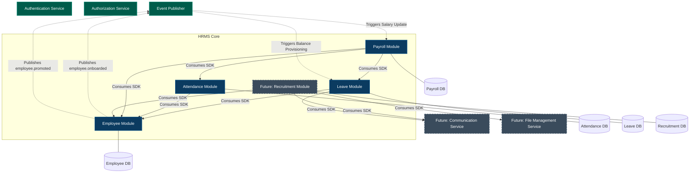

# 15 ARCHITECTURE DEPENDENCY MAP

## Description
This diagram represents the strict macro-architecture of the ERP. 
- **Solid arrows** represent synchronous data fetching via SDK boundaries.
- **Dotted arrows** represent asynchronous, decoupled side-effects via the Event Publisher.
- Databases remain strictly isolated per module. Cross-module database queries are architecturally impossible.
